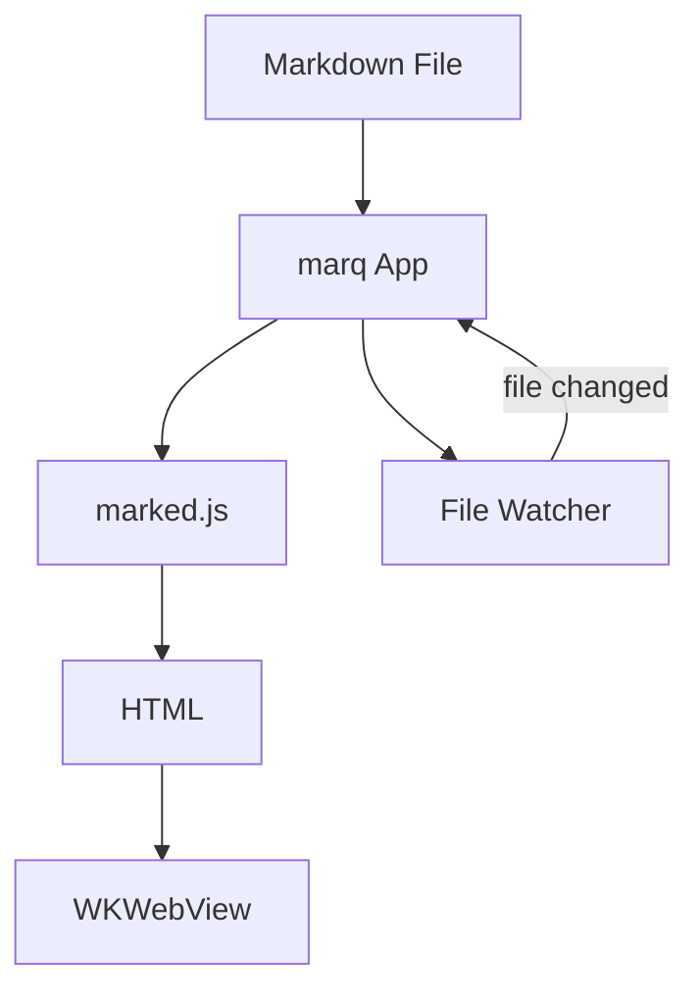
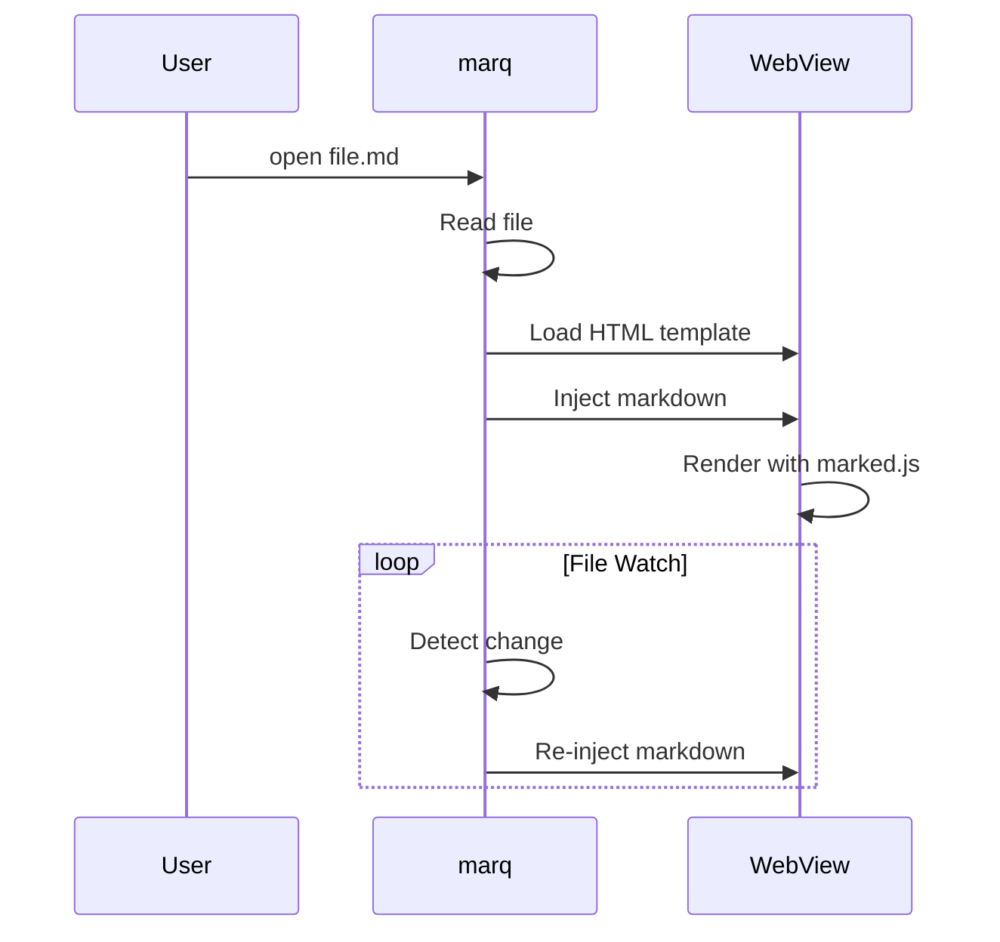

#  Marq Test Document

This is a test document for **Marq**, a macOS markdown viewer.

## Contents

Every entry below is an internal anchor link. Clicking one should jump to that
heading without leaving the document or reloading it. Note the awkward slugs:
`GPT-5.4` loses its full stop, and `Math / LaTeX` produces a double hyphen.

- [Navigation](#navigation)
- [Text Formatting](#text-formatting)
- [Links and Images](#links-and-images)
  - [GPT-5.4 Pelican Family](#gpt-54-pelican-family)
  - [Opus 4.6 Pelican on a Bicycle](#opus-46-pelican-on-a-bicycle)
- [Lists](#lists)
  - [Unordered](#unordered)
  - [Ordered](#ordered)
- [Task List](#task-list)
- [Table](#table)
  - [Prose columns](#prose-columns)
  - [Reference columns](#reference-columns)
- [Code Blocks](#code-blocks)
  - [JavaScript](#javascript)
  - [Python](#python)
  - [Kotlin](#kotlin)
  - [TypeScript](#typescript)
  - [Clojure](#clojure)
  - [Shell](#shell)
- [Mermaid Diagram](#mermaid-diagram)
- [Math / LaTeX](#math--latex)
- [Horizontal Rule](#horizontal-rule)
- [Keyboard Shortcuts](#keyboard-shortcuts)

## Navigation

Follow this link to a sub-document: [The Pirate's Log](subdir/pirates.md)

## Text Formatting

Here's some *italic*, **bold**, ~~strikethrough~~, and `inline code`.

> This is a blockquote with some wisdom about markdown rendering.

## Links and Images

[Link to GitHub](https://github.com)

### GPT-5.4 Pelican Family


*A pelican family rendered by GPT-5.4 — from [Simon Willison's pelican collection](https://simonwillison.net/2025/Jun/6/six-months-in-llms/)*

### Opus 4.6 Pelican on a Bicycle


*A pelican on a bicycle — generated by Claude Opus 4.6, locally saved*

## Lists

### Unordered
- First item
- Second item
  - Nested item
  - Another nested
- Third item

### Ordered
1. Step one
2. Step two
3. Step three

## Task List

- [x] Build the app
- [x] Render markdown
- [ ] World domination

## Table

Two six-column tables, each awkward in a different way. Both should fill the
window without a horizontal scrollbar, grow as the window widens, and fit inside
the paper width when exported to PDF.

### Prose columns

The first three columns hold a word or two each and should never wrap; `Summary`
takes a short paragraph, `Detail` a longer one, and `Log` several paragraphs.

| Feature | Status | Key | Summary | Detail | Log |
|---------|--------|-----|---------|--------|-----|
| Rendering | Done | `r` | Avast ye scurvy dogs, the mainsail be hoisted. | Hoist the mainsail afore the parrot pilfers the last of the hardtack, for the tide waits on no buccaneer and the reef be closer than the bosun reckons by half a league. | Yo ho ho and a bottle of rum, says the quartermaster, though the bottle be long empty and the rum longer gone.<br><br>The cap'n took one look at the reckoning and declared it the work of a landlubber, which it were, on account of the navigator having been pressed into service from a bakery in Bristol.<br><br>By the second watch we had run out of both biscuit and patience, and the parrot had begun repeating things it had no business repeating.<br><br>We made landfall at dawn with nothing to show for it but a torn topsail and a chart that proved, on closer inspection, to be a menu. |
| Highlighting | Done | `h` | Blimey, the cap'n be three sheets to the wind. | The crow's nest stands empty while we drift towards the shoals of Tortuga, and not a soul aboard has the heart to wake him for it. | Splice the mainbrace and batten down the hatches, lest the squall take the topgallant and the cook's best kettle with it.<br><br>The cook, for his part, has threatened mutiny over the kettle twice this voyage, and the articles say nothing whatsoever about kettles.<br><br>The bosun ruled in the cook's favour, which surprised everyone, not least the cook. |
| Diagrams | Done | `m` | Shiver me timbers, there be a kraken to larboard. | Nary a cannon loaded nor a powder monkey sober enough to load one, and the beast circling closer with every turn of the glass. | Dead men tell no tales, but the ship's log tells plenty, and this one speaks of a mutiny brewing below decks.<br><br>The kraken, it turned out, was a quantity of kelp and a trick of the light, though nobody was minded to say so out loud until well after supper.<br><br>The powder monkey has since been promoted, on the grounds that he was the only one who stayed asleep throughout.<br><br>The kelp was not mentioned again.<br><br>Neither was the promotion. |
| Math | Done | `x` | Arrr, fifteen men on a dead man's chest. | Every last one of them arguing over the reckoning of the longitude, which no soul aboard can compute without the chronometer. | The chronometer went over the side in the last blow, along with the spare compass and the second mate's dignity.<br><br>We have been navigating by argument ever since, which is slower than dead reckoning but considerably more entertaining.<br><br>Land was sighted on the ninth day, in entirely the wrong ocean. |
| Navigation | Done | `j/k/gg/G` | Walk the plank, ye bilge rat, the black spot be passed. | The articles be clear on the matter, and clearer still on what befalls them as argue with the articles at this hour of the night. | Weigh anchor and hoist the colours, we make for the Spanish Main by first light with whatever crew still draws breath.<br><br>Of the original complement of forty, some twenty-two remain, and of those perhaps twelve can be relied upon to pull in the same direction at the same time.<br><br>The remainder are accounted for in the ledger under a heading the purser declines to explain.<br><br>The purser has been declining to explain that heading since Cadiz. |

### Reference columns

The harder case, and the one that broke PDF export. Here *every* column is wide:
the short ones hold long unbreakable identifiers and links rather than ordinary
words, so their minimum widths are large. A table like this cannot fit A4 at full
size — export must scale it down rather than starve the prose columns or clip the
right-hand edge.

| Manifest | Endpoint | Vessel | Crew | Stowage | Notes |
|:---|:---|:---|:---|:---|:---|
| **Ship's Articles** | [`/v1/ships-articles`](https://charts.example.com/reference/articles/ships-articles-overview) | [`quartermaster-core`](https://github.com/blackspot/quartermaster-core) | Provisioning & Grog (P&G) | `DB quartermasterstore`: `TABLE articles_ledger` (plus `TABLE articles_signatory_group`, `TABLE contra_ledger`) | `quartermaster-core` be the source of truth for any vessel that has completed the reckoning. The signatory link be stored as an external mark (`signatory_external_mark`), not a proper key, and the mark itself lives in the bosun's locker where nobody has looked since Cadiz. |
| **Grog Rations** | [`/v0/grog-rations`](https://charts.example.com/reference/rations-overview) | [`bilgepump`](https://github.com/blackspot/bilgepump) | Below Decks | `DB sharedhold`: `TABLE rationGroup`, `TABLE rationGroupColumn`, `TABLE rationGroupRow`, `TABLE rationGroupValue` | A ration group be stored as a matrix. Columns be measures, rows be crew, and each cell be a `TABLE rationGroupValue` row keyed by `(columnId, rowId)`. The cook maintains this be an unnecessary abstraction over a barrel. |
| **Plunder Tally** | [`/v0/plunder-tally`](https://charts.example.com/reference/plunder-overview) | [`bilgepump`](https://github.com/blackspot/bilgepump) | Below Decks | `DB sharedhold`: `TABLE plunderTally` | Single flat table. Share stored as a decimal fraction (0.05, not a twentieth). Carries `incomingShareAccount` and `outgoingShareAccount` for the purser's reverse reckoning, plus a JSONB `meta` blob nobody has ever populated. |
| **Crew Roster** | [`/v1/crew`](https://charts.example.com/reference/crew/crew-api-overview) | [`pressgang`](https://github.com/blackspot/pressgang) | `crew-acquisition-and-retention` | Standalone `pressgang` service, hold not identified | `quartermaster-core` has no crew code at all. `bilgepump` holds only references: a nullable `crewId` and an embedded `signatory` JSONB on the articles row. The roster, its lifecycle (`PRESSED → SWORN → MAROONED`), and the manifest import all live in `pressgang`. |

## Code Blocks

### JavaScript
```javascript
function fibonacci(n) {
    if (n <= 1) return n;
    return fibonacci(n - 1) + fibonacci(n - 2);
}

console.log(fibonacci(10)); // 55
```

### Python
```python
def quicksort(arr):
    if len(arr) <= 1:
        return arr
    pivot = arr[len(arr) // 2]
    left = [x for x in arr if x < pivot]
    middle = [x for x in arr if x == pivot]
    right = [x for x in arr if x > pivot]
    return quicksort(left) + middle + quicksort(right)
```

### Kotlin
```kotlin
fun <T : Comparable<T>> List<T>.mergeSort(): List<T> {
    if (size <= 1) return this
    val mid = size / 2
    val left = subList(0, mid).mergeSort()
    val right = subList(mid, size).mergeSort()
    return merge(left, right)
}

private fun <T : Comparable<T>> merge(left: List<T>, right: List<T>): List<T> =
    buildList {
        var i = 0; var j = 0
        while (i < left.size && j < right.size) {
            if (left[i] <= right[j]) add(left[i++]) else add(right[j++])
        }
        addAll(left.subList(i, left.size))
        addAll(right.subList(j, right.size))
    }
```

### TypeScript
```typescript
interface Pipeline<T> {
    pipe<U>(fn: (value: T) => U): Pipeline<U>;
    value(): T;
}

function pipeline<T>(initial: T): Pipeline<T> {
    return {
        pipe: <U>(fn: (value: T) => U) => pipeline(fn(initial)),
        value: () => initial,
    };
}

const result = pipeline([3, 1, 4, 1, 5])
    .pipe(arr => arr.filter(n => n > 2))
    .pipe(arr => arr.map(n => n * 10))
    .value(); // [30, 40, 50]
```

### Clojure
```clojure
(defn game-of-life [cells]
  (let [neighbours (fn [[x y]]
                     (for [dx [-1 0 1] dy [-1 0 1]
                           :when (not= [dx dy] [0 0])]
                       [(+ x dx) (+ y dy)]))
        freq (frequencies (mapcat neighbours cells))]
    (set (for [[cell n] freq
               :when (or (= n 3) (and (= n 2) (cells cell)))]
           cell))))

(-> #{[1 0] [1 1] [1 2]}
    game-of-life
    game-of-life) ;; => #{[1 0] [1 1] [1 2]}
```

### Shell
```bash
#!/bin/bash
echo "Hello from marq!"
for i in {1..5}; do
    echo "Count: $i"
done
```

## Mermaid Diagram





## Math / LaTeX

Inline math: $E = mc^2$

Display math:

$$
\int_{-\infty}^{\infty} e^{-x^2} dx = \sqrt{\pi}
$$

The quadratic formula:

$$
x = \frac{-b \pm \sqrt{b^2 - 4ac}}{2a}
$$

Euler's identity: $e^{i\pi} + 1 = 0$

## Horizontal Rule

---

## Keyboard Shortcuts

Try these vim-style navigation keys:

| Key | Action |
|-----|--------|
| `j` | Scroll down |
| `k` | Scroll up |
| `Ctrl-D` | Half page down |
| `Ctrl-U` | Half page up |
| `gg` | Go to top |
| `G` | Go to bottom |
| `/` | Search |
| `n` | Next match |
| `N` | Previous match |
| `Esc` | Close search |

---

*Rendered by marq* ✨
