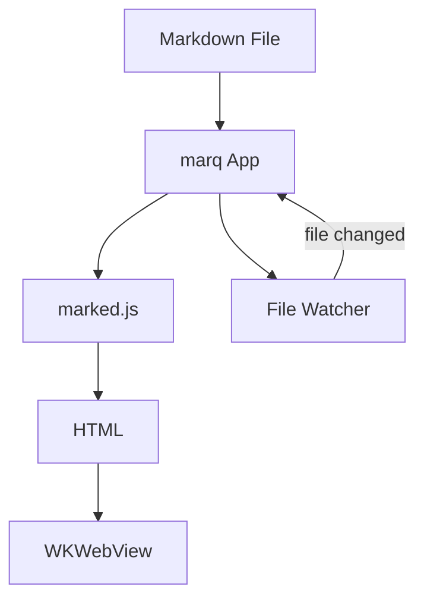
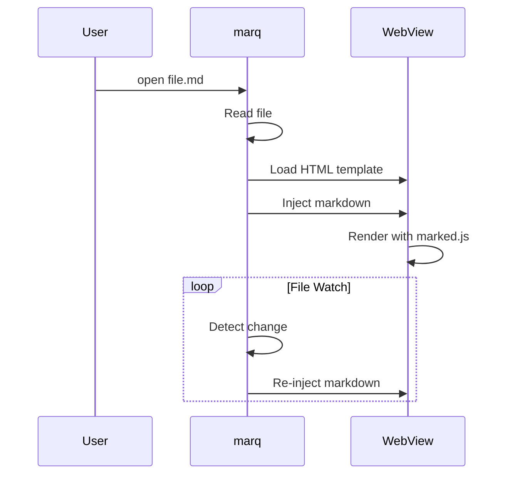

# marq Test Document

This is a test document for **marq**, a macOS markdown viewer.

## Text Formatting

Here's some *italic*, **bold**, ~~strikethrough~~, and `inline code`.

> This is a blockquote with some wisdom about markdown rendering.

## Links and Images

[Link to GitHub](https://github.com)


## Lists

### Unordered
- First item
- Second item
  - Nested item
  - Another nested
- Third item

### Ordered
1. Step one
2. Step two
3. Step three

## Task List

- [x] Build the app
- [x] Render markdown
- [ ] World domination

## Table

| Feature | Status | Notes |
|---------|--------|-------|
| Markdown rendering | Done | Using marked.js |
| Syntax highlighting | Done | highlight.js |
| Mermaid diagrams | Done | mermaid.js |
| Math/LaTeX | Done | MathJax |
| Vim navigation | Done | j/k/gg/G/Ctrl-D/U |

## Code Blocks

### JavaScript
```javascript
function fibonacci(n) {
    if (n <= 1) return n;
    return fibonacci(n - 1) + fibonacci(n - 2);
}

console.log(fibonacci(10)); // 55
```

### Python
```python
def quicksort(arr):
    if len(arr) <= 1:
        return arr
    pivot = arr[len(arr) // 2]
    left = [x for x in arr if x < pivot]
    middle = [x for x in arr if x == pivot]
    right = [x for x in arr if x > pivot]
    return quicksort(left) + middle + quicksort(right)
```

### Shell
```bash
#!/bin/bash
echo "Hello from marq!"
for i in {1..5}; do
    echo "Count: $i"
done
```

## Mermaid Diagram





## Math / LaTeX

Inline math: $E = mc^2$

Display math:

$$
\int_{-\infty}^{\infty} e^{-x^2} dx = \sqrt{\pi}
$$

The quadratic formula:

$$
x = \frac{-b \pm \sqrt{b^2 - 4ac}}{2a}
$$

Euler's identity: $e^{i\pi} + 1 = 0$

## Horizontal Rule

---

## Keyboard Shortcuts

Try these vim-style navigation keys:

| Key | Action |
|-----|--------|
| `j` | Scroll down |
| `k` | Scroll up |
| `Ctrl-D` | Half page down |
| `Ctrl-U` | Half page up |
| `gg` | Go to top |
| `G` | Go to bottom |
| `/` | Search |
| `n` | Next match |
| `N` | Previous match |
| `Esc` | Close search |

---

*Rendered by marq* ✨
